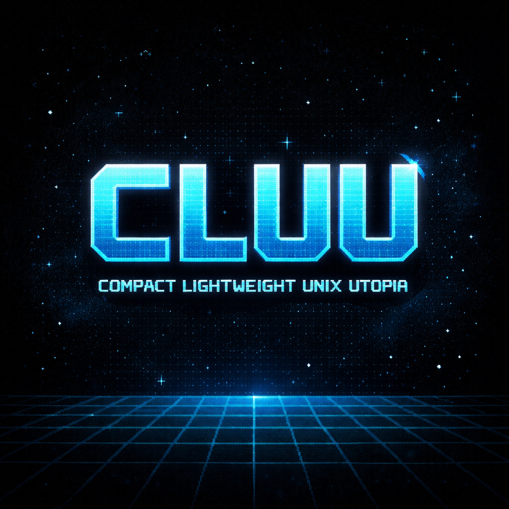
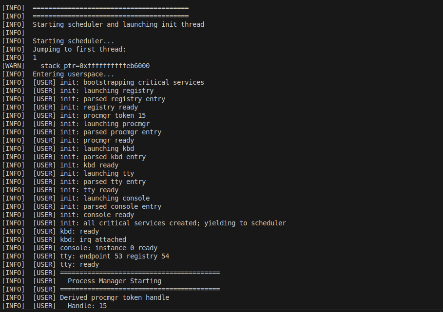
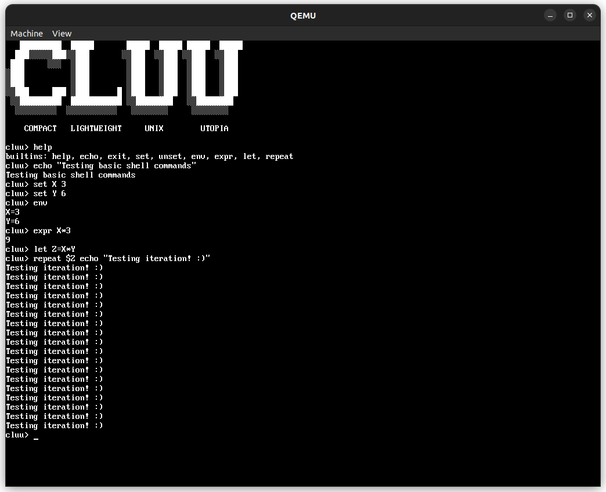
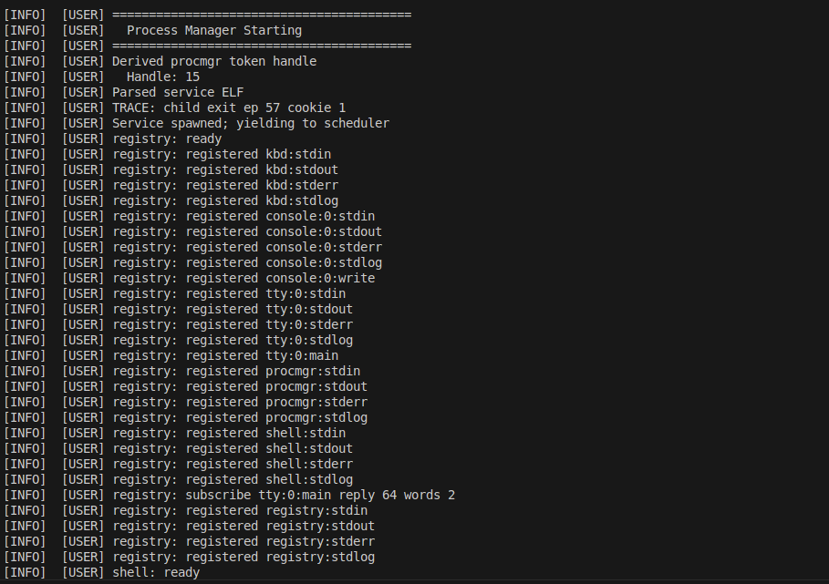

   

# CLUU (Compact Lightweight Unix Utopia)

**Current Capabilities (Quick Facts)**
- **Microkernel core**: scheduler, IPC, memory, tokens, IRQs, syscalls
- **IPC endpoints + registry**: dynamic endpoint registration and lazy subscription at runtime
- **Capability tokens**: unforgeable handles, explicit rights, transferable via IPC
- **Dataflow**: multi-subscriber outputs, per-process input ownership, runtime wiring
- **Userspace services**: init, registry, procmgr, console, tty, kbd, shell, vfs, ramfs
- **Tooling**: xtask build/run, initrd, QEMU debug with telnet + GDB

CLUU is a hobby operating system written in Rust, pursuing a **clean L4-inspired microkernel** architecture with strong emphasis on **minimality, and explicit authority**. The project is deliberately engineered, test-driven, and uncompromising about architectural discipline.

This README reflects the **current system status**. The token system and IPC/endpoint registry are integrated. Core kernel subsystems are implemented, tested, and internally consistent.

---

## Getting Started (Quick Run)

```
cargo xtask run --debug
```

Open the serial console:

```
telnet localhost 4321
```

Expected boot flow:

```
init -> registry -> procmgr -> kbd -> tty -> console -> shell
```

Primary dataflow:

```
kbd -> tty (line discipline) -> shell -> tty -> console
```

## Motivation

Modern monolithic kernels are large, implicit, and difficult to reason about. CLUU intentionally moves in the opposite direction:

* minimal kernel surface
* explicit authority via capabilities / tokens
* message-passing as the primary abstraction
* aggressive separation between mechanism (kernel) and policy (userspace)

The goal is not speed of development, but **clarity of design** and **long-term evolvability**.

---

## Design Pillars

* **Microkernel first** – scheduler, memory, IPC, tokens, interrupts
* **Everything else in userspace** – filesystems, drivers, services
* **Explicit authority** – no ambient permissions, no global namespaces
* **Deterministic control flow** – no hidden work, no implicit magic
* **SOLID by construction** – traits, composition, strict responsibility

---

## High-Level Architecture

```
+-------------------------+
|        Userspace		  |
|       (as of now)       |
|-------------------------|
| init | procmgr | vfs    |
| ramfs | console | shell |
| cat | drivers | servers |
+----------- IPC ---------+
|        Microkernel      |
|        (as of now)      |
|-------------------------|
| Scheduler | IPC | VMM   |
| PMM | Tokens | IRQ      |
| Syscalls | Timer        |
+-------------------------+
|        Hardware         |
+-------------------------+
```

The kernel provides **mechanisms only**. All policy lives in userspace.

---

## Kernel Status Overview

| Subsystem                 | Status     |
| ------------------------- | ---------- |
| Physical Memory (PMM)     | ✅ Complete |
| Virtual Memory (VMM)      | ✅ Complete |
| Address Spaces            | ✅ Complete |
| Scheduler                 | ✅ Complete |
| IPC (rendezvous)          | ✅ Complete |
| Capability / Token system | ✅ Complete |
| IRQ handling              | ✅ Complete |
| Syscall infrastructure    | ✅ Complete |
| Logging (IRQ-safe)        | ✅ Complete |
| Userspace ABI             | ✅ Stable   |

**Total kernel tests**: 145/145 passing

---

## Memory Model

### Address Spaces

Each process owns a strict address space:

```
USERSPACE
0x00000000  NULL guard
0x00400000  Text
0x00600000  Data / BSS
0x00800000  Heap (lazy)
0x7ff00000  Stack

KERNELSPACE (high half)
0xffff8000_00000000  physmap
0xffffffff_c0000000  kernel heap
```

* Lazy heap allocation via page faults
* Explicit validation of all user pointers
* No implicit memory sharing

---

## Scheduler

* O(1) **priority bitmap scheduler**
* 256 priority levels
* FIFO fairness within same priority
* Cooperative + preemptive modes
* Clean separation between policy and mechanism

```
Ready queues: [256]
Priority bitmap: 256 bits
pick_next(): O(1)
```

---

## IPC Model

IPC is **synchronous rendezvous**, inspired by L4:

```
Sender ----+      +---- Receiver
           |      |
           +-- IPC +
           |      |
Sender <-- +      + --> Receiver
```

* send / recv / call / reply / replyrecv
* optional buffer transfer
* copy / map / grant semantics
* deterministic blocking behavior

IPC is the **only communication primitive**.

---

## Endpoint Registry and Dataflow

Userspace endpoint wiring is **dynamic and lazy**:

- Each process **owns its input endpoints**.
- Output endpoints are **registered** with the registry service by name.
- Consumers **subscribe at runtime**; the registry brokers discovery and grant flow.
- Tokens are **transferred via blocking send/recv** (no new syscall numbers).
- Outputs can have **multiple subscribers**; inputs remain per-process.

Flow overview:

```
Requester -> registry.subscribe(producer, endpoint)
registry  -> producer.grant(requester)
producer  -> send(token) to requester (or via registry)
requester -> recv(token)
```

The registry stores **metadata only**. Tokens are issued by the endpoint owner and
granted on demand, preserving least privilege.

---

## Token-Based Authority System

All authority is represented by **cryptographically signed tokens**.

### Core Properties

* Opaque, non-enumerable object references
* Explicit rights bitmask
* Mandatory expiration
* Delegation via derivation
* HMAC-SHA256 integrity

Tokens are conceptually similar to JWTs, but **kernel-verified and capability-safe**.

```
Token = {
  scope   : OpaqueScope,
  rights  : RightsMask,
  issuer  : Kernel | Authority,
  expires : Timestamp,
  sig     : HMAC
}
```

No token → no authority → no operation.

---

## Syscall Surface (Minimal)

Only **7 syscalls** exist:

```
Send
Recv
Call
Reply
Yield
Invoke   (all privileged operations)
DebugPrint (debug only)
```

All resource manipulation flows through `sys_invoke()` using tokens.

---

## Interrupts & Exceptions

* Full x86_64 IDT
* All CPU exceptions handled
* Page faults integrated with VMM
* Timer IRQ drives preemption
* IRQ-safe logging (no locks, no allocation)

---

## Logging

* Zero-cost in release builds
* IRQ-safe
* No allocation
* Manual formatting
* UART-backed

Logging is a **diagnostic tool**, not a runtime dependency.

---

## Userspace

Userspace programs are:

* statically linked ELF binaries
* no_std
* linked against `libcluu`

`libcluu` provides:

* syscall wrappers
* IPC helpers
* error handling
* runtime entry point

### Core Services (Current)

```
init       - bootstrap and service spawning
registry   - endpoint registration and discovery
procmgr    - process management and exit notifications
kbd        - keyboard input producer
tty        - line discipline + stdio routing
console    - display output sink
shell      - interactive command frontend
vfs/ramfs  - filesystem services (evolving)
```

---

## Screenshots

Place screenshots under `artwork/` and link them here.

Suggested captures:
- **Boot + service bring-up**: telnet output showing `init` launching `registry`, `procmgr`, `kbd`, `tty`, `console`, `shell`.
- **Interactive shell**: a prompt with a few builtins (`help`, `set`, `expr`, `repeat`) and visible output routed via `tty`.
- **Registry activity**: telnet output showing endpoint registrations and a subscription/grant flow.
- **Console output**: framebuffer view showing the console rendering and cursor blink.

Screenshots:





## Bootloader

CLUU uses the **BOOTBOOT** bootloader as its stage-2 boot mechanism.

BOOTBOOT provides a clean, modern boot environment and deliberately minimal abstractions, aligning well with CLUU’s microkernel philosophy.

Key BOOTBOOT features used by CLUU:

* High-half kernel loading
* Identity-mapped physmap
* Early UART debug support
* Framebuffer setup
* Initrd delivery
* Strict boot-time memory map

The kernel is loaded as `sys/core` from the initrd, following BOOTBOOT conventions. All early platform setup (CPU mode, paging, memory discovery) is delegated to BOOTBOOT, allowing the kernel to remain focused on **core mechanisms only**.

---

## Build System

CLUU uses a **thin build wrapper around Rust’s `xtask` pattern**. The build system is intentionally explicit and scriptable, avoiding hidden magic.

### High-Level Principles

* `cargo xtask` is the **primary interface**
* `make` is provided only as a convenience wrapper
* Kernel and userspace are built with **custom Rust targets**
* Disk images are produced via **mkbootimg + BOOTBOOT**

---

### Makefile Interface (Convenience)

```makefile
all: build

build:
	cargo xtask build

run:
	cargo xtask run

run-debug:
	cargo xtask run --debug

test:
	cargo xtask test

clean:
	cargo xtask clean

userspace:
	cargo xtask userspace

kernel:
	cargo xtask kernel
```

Usage summary:

```
make build       # Build everything
make run         # Build and run in QEMU
make run-debug   # Run with GDB + telnet serial
make test        # Run all tests
make clean       # Clean artifacts
```

---

### Preferred Interface: cargo xtask

For idiomatic Rust development, **prefer using `cargo xtask` directly**:

```
cargo xtask build [--profile dev|release]
cargo xtask run [--profile dev|release]
cargo xtask run --debug
cargo xtask test
cargo xtask clean
cargo xtask userspace [--profile dev|release]
cargo xtask kernel [--profile dev|release]
```

---

### Debug Workflow

Debug mode starts QEMU paused with:

* GDB server on `localhost:1234`
* Telnet serial on `localhost:4321`

```
Terminal 1: cargo xtask run --debug
Terminal 2: telnet localhost 4321
Terminal 3: gdb target/.../kernel-*.elf
            (gdb) target remote :1234
            (gdb) continue
```

---

### xtask Responsibilities

The `xtask` binary orchestrates the full system build:

* Builds userspace programs (no_std ELFs)
* Builds the kernel (custom target)
* Assembles NASM sources
* Constructs initrd layout
* Invokes `mkbootimg` to generate `cluu.img`
* Launches QEMU (normal or debug)

`xtask` is intentionally **boring and explicit**: every step is visible, inspectable, and reproducible.

---

## Current Milestone

**Working userspace shell executing:**

```
$ cat file.txt
```

Demonstrates:

* scheduling
* IPC-based VFS
* zero-copy buffers
* userspace drivers
* token-based authority

---

## Non-Goals

* POSIX compatibility (explicitly not a goal)
* Monolithic drivers
* Implicit global state
* Fast iteration at the cost of clarity

---

## Philosophy

> If an operation is possible, the authority must be visible.
> If authority is visible, it must be explicit.
> If it is explicit, it must be minimal.

CLUU is intentionally slow, explicit, and strict — by design.

---

## Status

Active development. Architecture considered **stable**.
Implementation continues in userspace.
