# CLUU Architecture

> Audience: somebody on r/osdev who wants to see how CLUU is structured
> before deciding whether to read 100k LOC of Rust.
>
> Companion doc: [`INTERNALS.md`](INTERNALS.md) is the long-form
> per-subsystem deep dive. This doc is the map.

---

## 1. The 30-second mental model

CLUU is a microkernel. The kernel knows three things — **threads**,
**capability tokens**, and **IPC** — and almost nothing else. There is
no "process" abstraction in the kernel; processes are a userspace
construct that the process manager (`procmgr`) maintains. There is no
filesystem, no scheduler policy beyond priorities, no network stack.
Everything else lives in userspace.

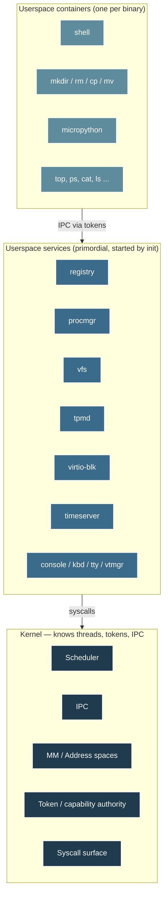

The arrow direction matters. Userspace **never** talks directly to the
kernel for filesystem/network/process operations — it talks to the
relevant userspace service via IPC, which uses syscalls only for
primitive operations like sending a message or mapping a page.

---

## 2. Kernel layout

Source under [`kernel/src/`](../kernel/src/). Six subsystems:

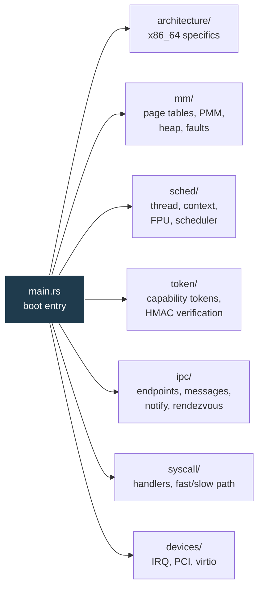

### What each subsystem owns

| Subsystem | Owns | Doesn't own |
|---|---|---|
| **`architecture/x86_64/`** | GDT, IDT, TSS, MSR setup, SYSCALL/SYSRET, CPU features, SMAP/SMEP | Higher-level scheduling, IPC semantics |
| **`mm/`** | Buddy allocator (PMM), page tables, demand paging, heap, frame registry, address spaces | Anything user-visible (mmap is just a thin syscall wrapper around space-map) |
| **`sched/`** | `Thread` struct, scheduler queues, priorities, FPU/SSE save/restore, suspend/resume | The notion of *process* (procmgr's job) |
| **`token/`** | `Token` (cap-handle), `ObjectRef`, HMAC issuance + verification, rights mask, scope, expiration | Persisting tokens across reboot (none of that exists) |
| **`ipc/`** | `Endpoint`, `Message`, send/recv/call/reply, notifications, rendezvous, payload transfer | Pretty-printing payloads (raw byte slices) |
| **`syscall/`** | The (small) syscall table, fast-path SYSCALL entry, ABI marshaling | Anything user-policy (capabilities decide what's allowed, not the syscall itself) |
| **`devices/`** | IRQ vector dispatch to userspace driver endpoints, PCI scan | Per-device protocol (drivers are userspace) |

### Kernel size signal

```text
kernel/src/   63 .rs files
              ~50 KLOC Rust + assembly
              0 LOC of "drivers" (all userspace)
```

---

## 3. The capability token system

Every authority-bearing operation in CLUU goes through a token.

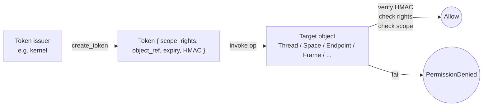

A token is a 64-bit handle that encodes:

- **Scope** — opaque identifier preventing cross-scope reuse.
- **Rights bitmask** — what operations this token authorizes.
- **Object reference** — which kernel object this token points at.
- **Expiration timestamp** — kernel-monotonic; revocation is instant.
- **HMAC-SHA256 signature** — covers the above; kernel-only key.

Tokens are unforgeable. Userspace can pass them around freely (e.g.
through IPC payloads), but if anyone tampers, the next syscall
verification rejects them.

**The big design choice:** when CLUU needs a "new thing the kernel can
do," the answer is almost never "add a syscall." It's "add an InvokeOp
on the existing token-dispatch path." Today there are ~70 invoke ops
(thread create/destroy/suspend/resume, space create/map/unmap, frame
allocate/free, etc.) — and basically a dozen actual syscalls.

See [`docs/INTERNALS.md`](INTERNALS.md) §"Token-Based Authority System"
for the full rights matrix.

---

## 4. IPC — the central nervous system

Three message types. Each goes through a token-protected `Endpoint`.

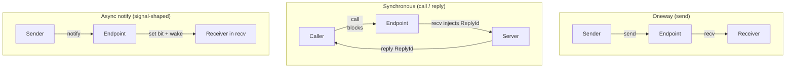

**Numbers (from the kernel audit):**

- Full call/reply round-trip: **~1,200 - 1,600 cycles**.
- Direct delivery (recipient already in `recv`) is ~7x faster than the queued path.
- Reply-tokens are kernel-injected, not minted by userspace — closes a
  whole class of forgery attacks.

**The registry pattern.** Userspace doesn't hardcode endpoint handles;
it asks the [`registry`](../userspace/registry) service for a token to
talk to a given named output (e.g. `vfs/main` or `procmgr/spawn`).
The registry hands out short-lived grant tokens. This means new
services can come up at any time, and the system rewires itself
without the kernel knowing anything about names.

---

## 5. Userspace service map

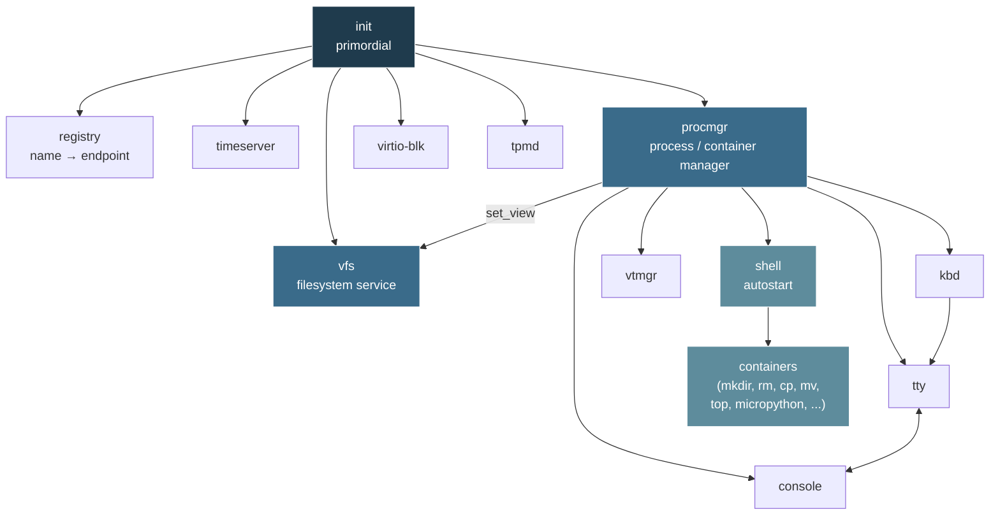

**Roles in one line each:**

- [`init`](../userspace/init) — boots the primordial services in order, monitors them for crashes, panics on primordial death.
- [`registry`](../userspace/registry) — service discovery: maps "name → endpoint token" for every service output and control endpoint.
- [`procmgr`](../userspace/procmgr) — owns processes and containers: spawn, exit, wait, signal, restart policy, /proc, top, sessions.
- [`vfs`](../userspace/vfs) — owns the filesystem namespace: mount table, per-client views, file/dir ops, mount-policy enforcement.
- [`virtio-blk`](../userspace/virtio-blk) — disk driver, exposes a block-device endpoint to vfs's ext2 backend.
- [`tpmd`](../userspace/tpmd) — TPM-backed entropy + password hashing for login.
- [`timeserver`](../userspace/timeserver) — wall-clock time + monotonic timer subscriptions.
- [`console / kbd / tty / vtmgr`](../userspace/) — the terminal stack: kbd reads scancodes, tty owns line discipline + history, console renders text into the framebuffer, vtmgr arbitrates between virtual terminals.
- [`shell`](../userspace/shell) — DIY shell with a [`pest` grammar](../userspace/shell/src/cluu_lang) and a Rust executor. Builtins (`cd`, `ls`, `cat`, `touch`, `top`, ...) plus `spawn`-via-procmgr.
- [`libcluu`](../userspace/libcluu) — the userspace runtime: capability + IPC wrappers, POSIX shim (file/process/pthread/signal), VFS client, registry client, allocator, vspace, args/env decoder.

**Counts:** 27 top-level userspace crates, 114 .rs files (excluding
newlib + tests).

---

## 6. The container model — what makes CLUU actually distinctive

> **A precise word, before we continue.** This section talks about
> "containers." That word is misleading. A CLUU "container" is **not**
> a Docker-style image bundle — there's no parallel runtime, no
> namespace + cgroup recreation, no replicated rootfs, no shipped
> image. A CLUU binary is spawned with a declarative *authority
> envelope* — capability profile + VFS view + mount policy + restart
> policy — read from its `Cluufile` manifest. The kernel doesn't know
> about Cluufiles at all; procmgr reads the manifest and applies the
> envelope at spawn time. **Encapsulation at spawn**, not
> containerization. The repo directory is named `containers/` for
> historical reasons, but the technically precise term is
> *capability-scoped binary*.

Every userspace binary has a declarative `Cluufile`.

```text
containers/rm/Cluufile:
    FROM minimal
    PROFILE ipc vfs registry
    MOUNT /tmp inherit
    BUILD "cargo build ..." target/.../rm.elf /bin/rm
    ENTRYPOINT /bin/rm
```

The build tool ([`tools/container-build`](../tools/container-build))
parses `Cluufile`s and emits per-container `manifest.toml` files into
`target/containers/<name>/`. At spawn time, procmgr reads the
manifest and constructs the spawned process's authority and view.

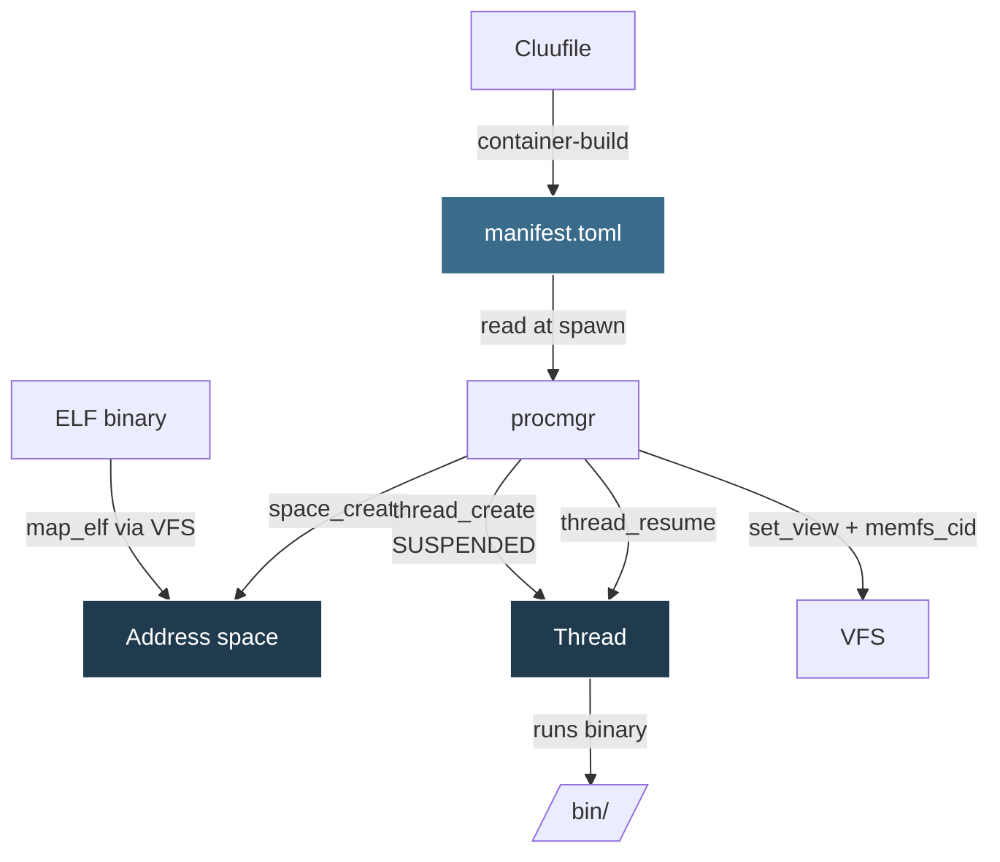

**Why SUSPENDED + resume:** the kernel creates the thread suspended,
procmgr sends `set_view` to VFS so its view is installed in VFS's
inbox, then procmgr resumes the thread. The IPC ordering guarantee
(VFS processes its inbox in send order) closes the race where a freshly
created thread could reach VFS before its view did. See
the suspend-bracket pattern (kernel `THREAD_CREATE_START_SUSPENDED` flag + procmgr's `install_view_and_run` helper).

### Container profile bits

A container's `PROFILE` line in its Cluufile maps to a `CapProfile`
bitmask. The bitmask drives which default mounts the container sees:

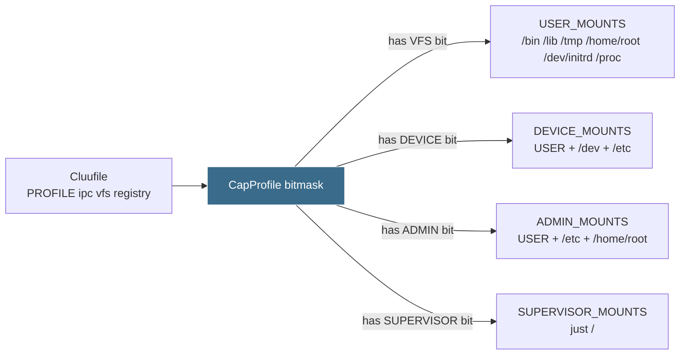

Defined in [`userspace/libcluu/src/vfs_view.rs`](../userspace/libcluu/src/vfs_view.rs).

---

## 7. Mount policy — the bit shipped this week

Containers can declare per-path mount inheritance in their Cluufile:

```
MOUNT /tmp private    # fresh per-container MemFs (shell does this)
MOUNT /tmp inherit    # default — use parent container's MemFs
```

The default makes shell pipelines work — `mkdir /tmp/x; rm /tmp/x`
across two spawned containers actually shares `/tmp/x`. The shell
itself opts into private to anchor a session-scoped `/tmp`.

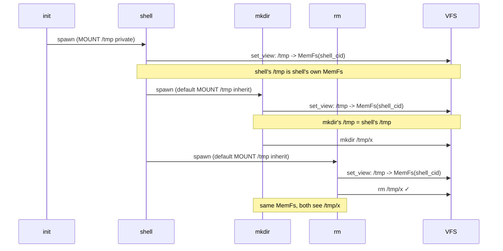

Implementation: `MOUNT` directive parser in `tools/container-build/src/main.rs`; per-path policy resolution in `userspace/procmgr/src/mount_policy.rs`; the wire-level extension is a per-mount `memfs_cid` field in `VFS_SET_VIEW` (see `userspace/libcluu/src/ipc.rs:VFS_SET_VIEW_LABEL`).

---

## 8. Boot sequence

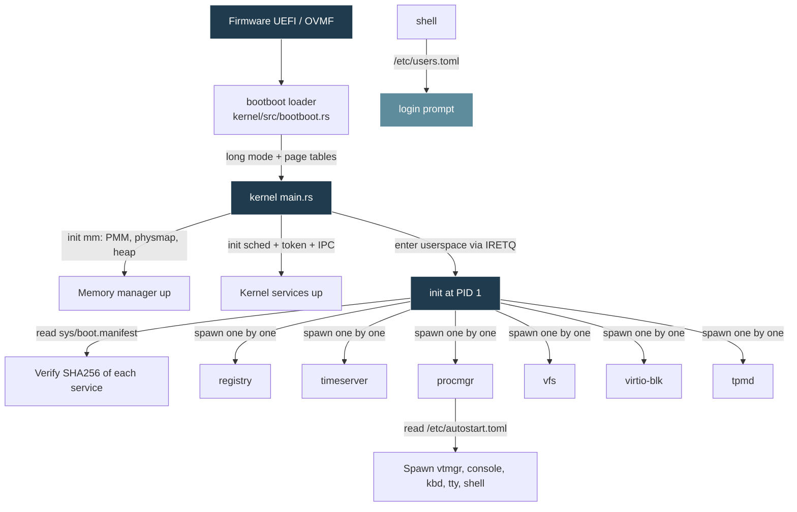

**Time budget on a typical boot:** firmware to login prompt is ~10-15
seconds in QEMU with KVM, dominated by initrd parse + ext2 fsck +
service spawn order. The kernel itself is ready in well under a
second.

---

## 9. The terminal stack (a slice you can read end-to-end)

This is the simplest non-trivial example of CLUU's userspace design —
five services collaborating to give you a typing experience:

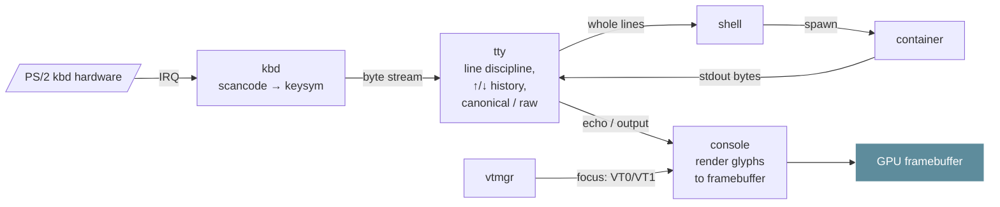

Each box is its own container with its own capability profile. They
talk over capability-token-protected endpoints. None of them know
about each other except by name (resolved via registry).

---

## 10. Build and test surface

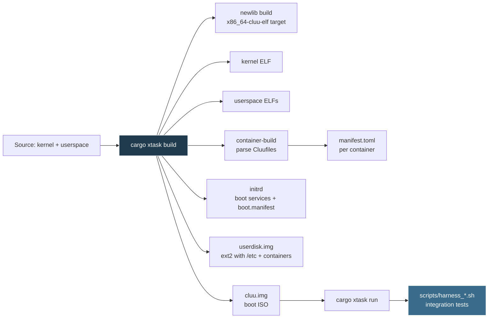

- Test count today: **47 integration cases** (mix of IPC, security, l2 shell, perf, container lifecycle, kernel-primitive smokes), **44 currently passing**.
- Unit tests for pure-logic modules use `rustc --test` directly (most userspace crates are `#![no_std]` so `cargo test` per-package doesn't work).

---

## 11. Where to read further

| If you want… | Read |
|---|---|
| Long-form per-subsystem deep-dive | [`docs/INTERNALS.md`](INTERNALS.md) |
| Why CLUU exists, what it isn't, the phased plan | [`docs/ROADMAP.md`](ROADMAP.md) |
| Test harness driver and how to run cases | [`docs/HARNESS.md`](HARNESS.md) |
| IPC + registry design references | [`docs/IPC_REGISTRY.md`](IPC_REGISTRY.md) |
| Process isolation and capability profiles | [`docs/PROCESS_ISOLATION_DESIGN.md`](PROCESS_ISOLATION_DESIGN.md) |
| Kernel internal audit notes | [`docs/KERNEL_AUDIT.md`](KERNEL_AUDIT.md) |
| Repo navigation guide | [`docs/REPO_LAYOUT.md`](REPO_LAYOUT.md) |

---

*This doc reflects the state at* `git log -1 --format=%h docs/ARCHITECTURE.md`. *Older diagrams are wrong on purpose — re-render them when something material changes, don't bandage them.*
